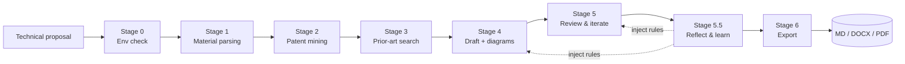

<p align="right">English | <a href="README_zh.md">中文</a></p>

<div align="center">

# CazzPatent

**AI patent disclosure drafting assistant** — a DeepSeek Harness plugin that turns technical proposals into submission-ready patent disclosures.

[](LICENSE)
[](https://www.python.org/)
[](https://github.com/deepseek-ai/deepseek-harness)
[](https://github.com/YangCazz/CazzPatent/actions/workflows/ci.yml)
[](.)

</div>

---

## What is this?

CazzPatent is a **DeepSeek Harness plugin** that acts as an AI patent agent. It walks a raw technical proposal through an 8-stage pipeline — environment check, material parsing, patent-point mining, prior-art search, drafting + diagram generation, review & iteration, reflection & learning, and multi-format export — producing a disclosure ready for firm review.

It ships as two complementary parts:

| Part | Role | Install |
|------|------|---------|
| `cazz-patent` **Skill** | Instruction brain: 8-stage workflow + self-improving memory + 6 Python tools | Drop into `.dsh/skills/` or `customSkillDirs` |
| `plugin/` **Cordis plugin** | Deterministic tools: 5 schema-validated Python tool wrappers | `dsh plugin add github:YangCazz/CazzPatent` |

## Pipeline



> **Stage 5.5 (Reflect & learn)** extracts reusable rules from iteration history, dual-scores them, and regenerates injection fragments — "fix once, never repeat" — so later proposals benefit automatically.

## Highlights

- **LaTeX → OMML native equations**: 350+ symbols + 96 structural commands — fractions, sub/superscripts, sums, integrals, matrices, accents, Greek, and fonts (`\mathbb`/`\mathfrak`/`\mathsf`/`\mathtt`/`\mathscr`) all render as editable Word equations — no MathML, no images.
- **Four-phase diagram pipeline**: Mermaid logic sketch → 6-point validation → HTML+SVG polish → 3× DPI PNG, three formats per figure.
- **Self-improving memory**: ledger.json with dual scoring (confirm_count + effectiveness) + domain routing + injection fragments, seeded with 9 rules distilled from 15 real proposals.
- **Triple-engine PDF export**: Word COM / LibreOffice / weasyprint fallback, cross-platform.
- **Deterministic tools**: the Cordis plugin registers the 6 scripts as schema-validated tools with configurable pythonPath / scriptsDir / defaultTimeoutMs.

## Installation

### Skill (instruction brain)

```sh
# User-level: available to every project
git clone https://github.com/YangCazz/CazzPatent ~/.dsh/skills/cazz-patent

# Or project-level: copy into a single project
#   cp -r cazz-patent/ <project>/.dsh/skills/

# Or a custom root: point customSkillDirs at the repo in cordis.yml
#   customSkillDirs: [/absolute/path/to/CazzPatent]
```

### Plugin (deterministic tools)

```sh
dsh plugin --profile demo add github:YangCazz/CazzPatent#<sha>
```

## Quick start

```sh
# 1. Python environment (the Skill's toolchain)
pip install -r requirements.txt
playwright install chromium

# 2. Invoke the Skill in a DSH session
#    /skill:cazz-patent <your technical proposal>

# 3. Or use the CLI tools directly
python cazz-patent/scripts/md_to_docx.py disclosure.md -o disclosure.docx
python cazz-patent/scripts/docx_to_pdf.py disclosure.docx -o disclosure.pdf
python cazz-patent/scripts/batch_diagrams.py --base outputs
```

## Configuration

The Skill is identity-neutral; placeholders resolve from your material at run time:

- `{提案人}` — the proposer's name, taken from the 基本信息 table or your material's file-name prefix; the model asks when it is missing.

Plugin tool options (override in the profile's `cordis.patch.yml`):

| Field | Default | Meaning |
|-------|---------|---------|
| `pythonPath` | `python` | Python interpreter to invoke the scripts |
| `scriptsDir` | bundled `scripts/` | Directory containing the Python scripts |
| `defaultTimeoutMs` | `300000` | Per-run timeout |

## Directory layout

```
CazzPatent/
├── cazz-patent/          # DSH Skill (instruction brain)
│   ├── SKILL.md          # 8-stage entry point
│   ├── prompts/          # 6 stage prompts
│   ├── scripts/          # 6 Python tools
│   ├── templates/        # disclosure template + diagram HTML template
│   └── memory/           # self-improving memory (ledger + corrections + injections)
├── plugin/               # Cordis plugin (deterministic tools)
│   ├── src/index.ts      # 5 tools + config
│   ├── scripts/          # bundled Python scripts
│   ├── esbuild.config.mjs
│   └── cordis.patch.yml
├── tests/                # pytest suite (11 cases)
├── README.md / README_zh.md
├── requirements.txt
├── LICENSE
└── .github/workflows/ci.yml
```

## Tests

```sh
pip install python-docx pytest
python -m pytest tests -q
```

CI runs the tests on every push and pull request.

## Contributing

Issues and pull requests are welcome. See [CONTRIBUTING.md](CONTRIBUTING.md).

## License

[MIT](LICENSE) © 2026 YangCazz
