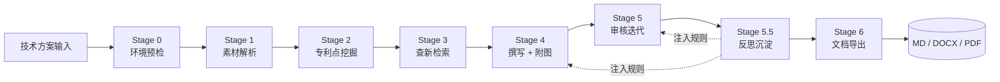

<p align="right"><a href="README.md">English</a> | 中文</p>

<div align="center">

# CazzPatent

**AI 专利交底书撰写助手** —— 一个 DeepSeek Harness 插件，把技术方案转化为可直接提交的专利交底书。

[](LICENSE)
[](https://www.python.org/)
[](https://github.com/deepseek-ai/deepseek-harness)
[](https://github.com/YangCazz/CazzPatent/actions/workflows/ci.yml)
[](.)

</div>

---

## 这是什么？

CazzPatent 是一个 **DeepSeek Harness 插件**，扮演 AI 专利代理人的角色。它把原始技术方案送进一条 8 阶段管线——环境预检、素材解析、专利点挖掘、查新检索、撰写+附图、审核迭代、反思沉淀、多格式导出——产出可直接提交代理机构审查的交底书。

由两个互补部分组成：

| 部分 | 作用 | 安装方式 |
|------|------|----------|
| `cazz-patent` **Skill** | 指令大脑：8 阶段工作流 + 自改进记忆 + 6 个 Python 工具 | 放入 `.dsh/skills/` 或 `customSkillDirs` |
| `plugin/` **Cordis 插件** | 确定性工具：5 个带 schema 校验的 Python 工具包装 | `dsh plugin add github:YangCazz/CazzPatent` |

## 工作流



> **Stage 5.5 反思沉淀** 从迭代历史中提取可复用规则、双重评分、重生成注入片段——「纠正一次，永不重复」，让后续提案自动受益。

## 核心亮点

- **LaTeX → OMML 原生方程式**：350+ 符号 + 96 结构命令，分式/上下标/求和/积分/矩阵/重音/希腊字母/字体（`\mathbb`/`\mathfrak`/`\mathsf`/`\mathtt`/`\mathscr`）全部渲染为可编辑的 Word 方程，无 MathML、无图片。
- **四阶段附图管线**：Mermaid 逻辑草图 → 6 项校验 → HTML+SVG 精修 → 3× DPI PNG，每张图三种格式齐备。
- **自改进记忆系统**：ledger.json 双重评分（confirm_count + effectiveness）+ 领域路由 + 注入片段，随包附带 15 个真实提案提炼的 9 条种子规则。
- **三级 PDF 导出**：Word COM / LibreOffice / weasyprint 自动回退，跨平台可用。
- **确定性工具**：Cordis 插件把 6 个脚本注册为带 schema 校验的工具，参数可配置（pythonPath / scriptsDir / defaultTimeoutMs）。

## 安装

### Skill（指令大脑）

```sh
# 用户级：对所有项目可用
git clone https://github.com/YangCazz/CazzPatent ~/.dsh/skills/cazz-patent

# 或项目级：复制到单个项目
#   cp -r cazz-patent/ <project>/.dsh/skills/

# 或自定义根目录：在 cordis.yml 里指向仓库根
#   customSkillDirs: [/absolute/path/to/CazzPatent]
```

### 插件（确定性工具）

```sh
dsh plugin --profile demo add github:YangCazz/CazzPatent#<sha>
```

## 快速开始

```sh
# 1. Python 环境（Skill 的工具链）
pip install -r requirements.txt
playwright install chromium

# 2. 在 DSH 会话中调用 Skill
#    /skill:cazz-patent 请基于以下技术方案撰写专利交底书…

# 3. 或直接使用命令行工具
python cazz-patent/scripts/md_to_docx.py 交底书.md -o 交底书.docx
python cazz-patent/scripts/docx_to_pdf.py 交底书.docx -o 交底书.pdf
python cazz-patent/scripts/batch_diagrams.py --base 专利输出
```

## 配置

Skill 与身份无关，占位符在运行时从素材解析：

- `{提案人}` —— 提案人姓名，取自「基本信息」表或素材文件名前缀；缺失时询问用户。

插件工具的可配置项（在 profile 的 `cordis.patch.yml` 覆盖）：

| 字段 | 默认 | 含义 |
|------|------|------|
| `pythonPath` | `python` | Python 解释器路径 |
| `scriptsDir` | 内置 `scripts/` | Python 脚本目录 |
| `defaultTimeoutMs` | `300000` | 每次运行超时 |

## 目录结构

```
CazzPatent/
├── cazz-patent/          # DSH Skill（指令大脑）
│   ├── SKILL.md          # 8 阶段调度入口
│   ├── prompts/          # 6 份阶段提示词
│   ├── scripts/          # 6 个 Python 工具
│   ├── templates/        # 交底书模板 + 附图 HTML 模板
│   └── memory/           # 自改进记忆（ledger + corrections + injections）
├── plugin/               # Cordis 插件（确定性工具）
│   ├── src/index.ts      # 5 个工具 + 配置
│   ├── scripts/          # 随包 Python 脚本
│   ├── esbuild.config.mjs
│   └── cordis.patch.yml
├── tests/                # pytest 测试套件（11 个用例）
├── README.md / README_zh.md
├── requirements.txt
├── LICENSE
└── .github/workflows/ci.yml
```

## 测试

```sh
pip install python-docx pytest
python -m pytest tests -q
```

CI 会在每次 push / PR 时自动运行测试。

## 贡献

欢迎提交 Issue 和 Pull Request。详见 [CONTRIBUTING.md](CONTRIBUTING.md)。

## 许可

[MIT](LICENSE) © 2026 YangCazz
